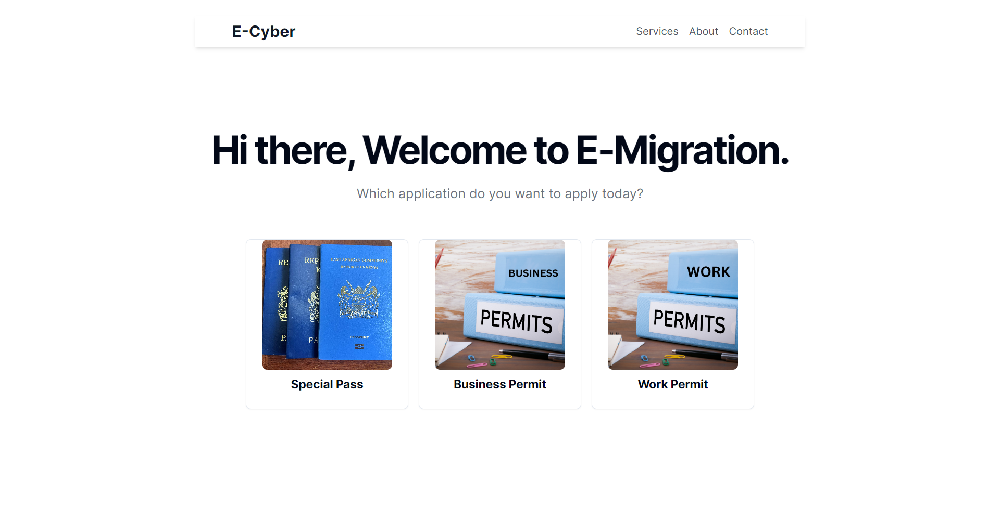
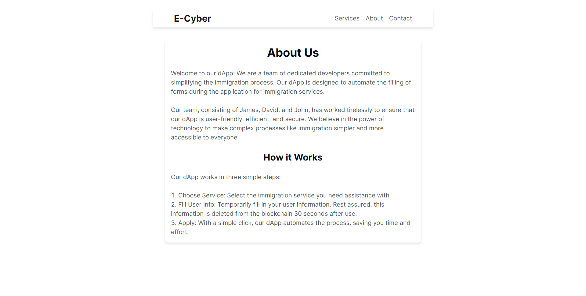
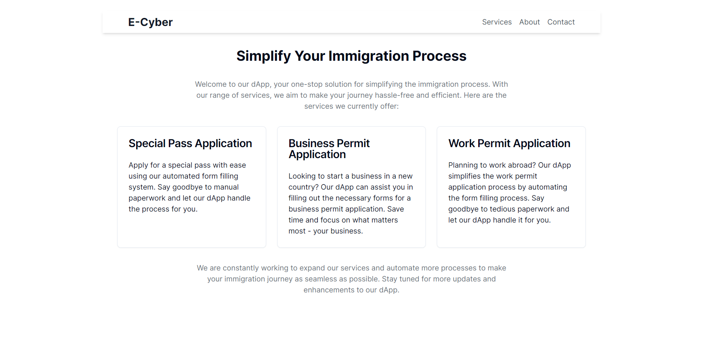
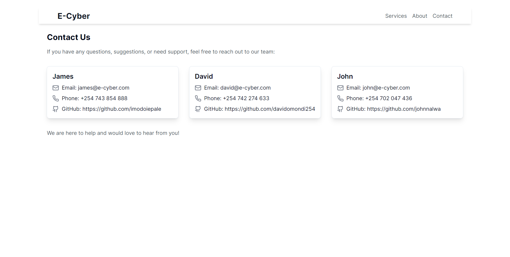

# E-Cyber - E-Migation (Immigration Automation dApp)

Welcome to the Immigration dApp, a decentralized solution designed to simplify the immigration process using cutting-edge technology. Our dedicated team of developers, comprising James, David, and John, has crafted this application to automate and streamline form-filling procedures associated with immigration services. We aim to provide a user-friendly, efficient, and secure experience for all.

## How It Works

1. **Choose Service:** Select the immigration service you need assistance with.
2. **Fill User Info:** Temporarily input your user information, securely deleted from the blockchain after 30 seconds.
3. **Apply:** With a single click, our dApp automates the entire process, saving you time and effort.

## Services

### Special Pass Application
Apply for a special pass effortlessly with our automated form-filling system. No more manual paperwork – let our dApp handle it for you.

### Business Permit Application
Starting a business in a new country? Our dApp assists you in filling out the necessary forms for a business permit application, letting you focus on your business.

### Work Permit Application
Planning to work abroad? Simplify the work permit application process with our dApp. Say goodbye to tedious paperwork.

We are committed to expanding our services continually, automating more processes to make your immigration journey seamless. Stay tuned for updates and enhancements to our dApp.

## Getting Started

1. Clone the repository.
2. Install dependencies using `npm install`.
3. Run the application locally with `npm start`.

## Live Demo

Check out our live demo [here](https://p4hsy-kiaaa-aaaal-admza-cai.icp0.io/) to experience the Immigration dApp in action.

## Screenshots

## Contributing

We welcome contributions! If you find a bug or have an idea for improvement, please open an issue or submit a pull request.

## Contact Us

For any questions, suggestions, or support, feel free to reach out to our team:

- **James:**
  - Email: james@e-cyber.com
  - Phone: +254 743 854 888
  - GitHub: [James GitHub](https://github.com/imodoiepale)

- **David:**
  - Email: david@e-cyber.com
  - Phone: +254 742 274 633
  - GitHub: [David GitHub](https://github.com/davidomondi254)

- **John:**
  - Email: john@e-cyber.com
  - Phone: +254 702 047 436
  - GitHub: [John GitHub](https://github.com/johnnalwa)

We are here to help and would love to hear from you!
